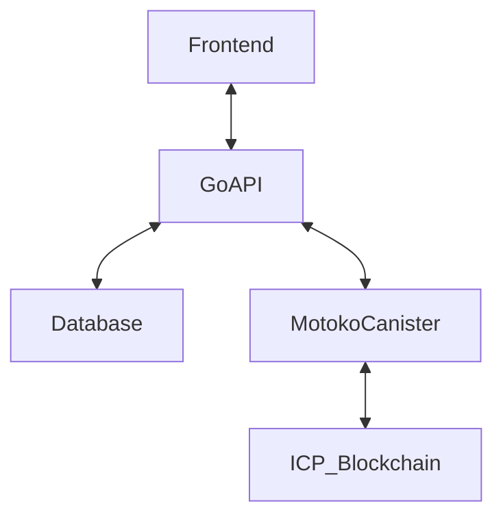

# PeduliCarbon

PeduliCarbon adalah platform yang mengubah aksi lingkungan komunitas menjadi aset digital (NFT Karbon) yang dapat diverifikasi dan diperjualbelikan di blockchain Internet Computer (ICP).

---

## Fitur Utama
- Onboarding & Profil (Internet Identity/Google)
- Dashboard Misi (ambil & selesaikan misi harian)
- Verifikasi aksi (foto, GPS, OCR)
- Mint NFT Karbon (on-chain ICP)
- Dompet digital: NFT, Poin, Saldo Rupiah
- Marketplace hadiah & penarikan saldo

---

## Arsitektur Sistem



- **Go Backend API**: Middleware, handle HTTP, database, komunikasi ke canister Motoko
- **Motoko Canister (ICP)**: Smart contract, logika verifikasi, mint NFT, reward, dsb

---

## User Flow (Rina)
1. **Onboarding**: Daftar/login via Internet Identity/Google
2. **Ambil Misi**: Pilih misi harian (misal: naik KRL)
3. **Verifikasi**: Upload bukti (foto tiket, GPS, dsb)
4. **Mint NFT**: Backend call Motoko untuk mint NFT karbon
5. **Reward**: Poin & NFT masuk ke dompet digital
6. **Tukar Hadiah**: Poin bisa ditukar voucher, saldo bisa ditarik ke e-wallet

---

## Setup Go Backend

1. **Clone repo & install dependency**
   ```bash
   git clone <repo-url>
   cd pedulicarbon
   go mod tidy
   ```
2. **Buat file .env** (lihat `.env.example`)
3. **Jalankan database PostgreSQL**
4. **Jalankan backend**
   ```bash
   go run main.go
   ```

---

## Deploy & Test Motoko Canister (ICP)

1. **Install DFX SDK**
   ```bash
   sh -ci "$(curl -fsSL https://internetcomputer.org/install.sh)"
   dfx --version
   ```
2. **Inisialisasi project Motoko**
   ```bash
   cd motoko
   dfx new pedulicarbon
   cp pedulicarbon.mo src/pedulicarbon/main.mo
   dfx start --background
   dfx deploy
   ```
3. **Cek canister ID**
   ```bash
   dfx canister id pedulicarbon
   ```
4. **Panggil fungsi canister**
   ```bash
   dfx canister call pedulicarbon mint_nft '(principal "<user>", 1, 1.2)'
   ```

---

## Integrasi Go ↔️ Motoko
- Go backend menggunakan package `internal/motoko/client.go` untuk call canister ICP
- Fungsi utama:
  - `VerifyAction` (verifikasi aksi user)
  - `MintNFT` (mint NFT karbon)
  - `GetUserNFTs` (daftar NFT user)
  - `GetNFTDetail` (detail NFT)
- Untuk produksi, gunakan [dfinity/agent-go](https://github.com/dfinity/agent-go) atau HTTP call ke endpoint ICP

---

## System Design (Ringkas)
- **User** → **Go API** → **DB** (sesi, data non-blockchain)
- **Go API** → **Motoko Canister** (aksi penting: verifikasi, mint NFT, reward)
- **Motoko Canister** → **ICP Blockchain** (NFT, reward, log aksi)

---

## Catatan
- Semua endpoint sudah siap untuk frontend/mobile
- Motoko canister dummy, siap di-deploy dan diintegrasikan
- Untuk integrasi production, update client Go dengan call HTTP/agent-go ke canister ICP

---

## Deploy ke Testnet ICP & Integrasi Go Backend

### 1. Deploy Canister ke Testnet ICP

#### A. Install DFX SDK
```bash
sh -ci "$(curl -fsSL https://internetcomputer.org/install.sh)"
dfx --version
```

#### B. Login/Setup Identity ICP
```bash
dfx identity new pedulicarbon-dev
dfx identity use pedulicarbon-dev
```

#### C. Deploy ke Testnet (IC mainnet)
1. Edit `dfx.json` agar canister `pedulicarbon` dan file Motoko sudah benar.
2. Deploy ke testnet:
   ```bash
   dfx deploy --network ic
   ```
3. Cek canister ID:
   ```bash
   dfx canister id pedulicarbon --network ic
   ```

### 2. Integrasi Go Backend ke Canister Testnet

#### A. Update `.env`
Isi `ICP_CANISTER_URL` dengan endpoint testnet:
```
ICP_CANISTER_URL=https://ic0.app/api/v2/canister/<CANISTER_ID>
```
Ganti `<CANISTER_ID>` dengan hasil dari langkah sebelumnya.

#### B. Update Client Go
- Untuk call ke canister di testnet, gunakan HTTP POST ke endpoint di atas.
- Untuk produksi, gunakan [dfinity/agent-go](https://github.com/dfinity/agent-go) agar bisa encode/decode candid dan call method canister dengan aman.

#### C. Contoh Call HTTP (Manual)
Misal, untuk call candid method (mint_nft), gunakan tools seperti [ic-repl](https://github.com/chenyan2002/ic-repl) atau `dfx canister call` dari CLI.

### 3. Testing End-to-End
- Jalankan backend Go (`go run main.go`)
- Deploy canister ke testnet
- Pastikan endpoint Go yang mengakses Motoko (misal: mint NFT, verifikasi aksi) sudah mengarah ke canister testnet
- Cek hasil di canister (bisa pakai dfx/CLI/ic-repl)

### 4. Tips & Resources
- [ICP Docs: Deploy to Mainnet](https://internetcomputer.org/docs/current/developer-docs/production/deploy-mainnet)
- [Motoko Playground](https://m7sm4-2iaaa-aaaab-qabra-cai.ic0.app/) (untuk eksperimen Motoko)
- [agent-go](https://github.com/dfinity/agent-go) (Go SDK untuk ICP)

---

### Flow Integrasi
1. **Frontend** → **Go Backend** → **Motoko Canister (Testnet)**
2. Semua aksi penting (mint NFT, verifikasi) akan tercatat di blockchain ICP testnet. 

## Contoh API: Create Mission

Endpoint: `POST /missions`

Field wajib:
- `title` (judul misi)
- `description` (deskripsi)
- `asset_type` (misal: NFT, Carbon)
- `asset_amount` (harus > 0)
- `verification_type` (misal: photo, gps, ocr)

Jika field kosong/tidak valid, akan return error 400.

### Contoh JSON
```json
{
  "title": "Naik KRL ke kantor",
  "description": "Pergi ke kantor menggunakan KRL untuk mengurangi emisi karbon.",
  "asset_type": "NFT",
  "asset_amount": 1.5,
  "verification_type": "photo"
}
```

### Contoh curl
```bash
curl -X POST http://localhost:8080/missions \
  -H "Content-Type: application/json" \
  -d '{
    "title": "Naik KRL ke kantor",
    "description": "Pergi ke kantor menggunakan KRL untuk mengurangi emisi karbon.",
    "asset_type": "NFT",
    "asset_amount": 1.5,
    "verification_type": "photo"
  }'
``` 