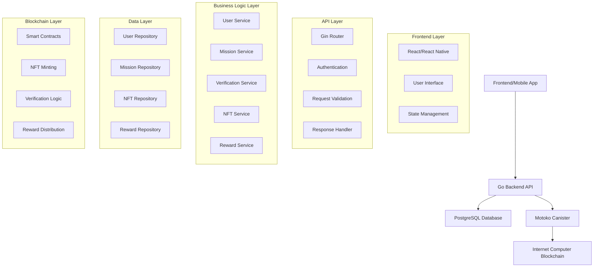
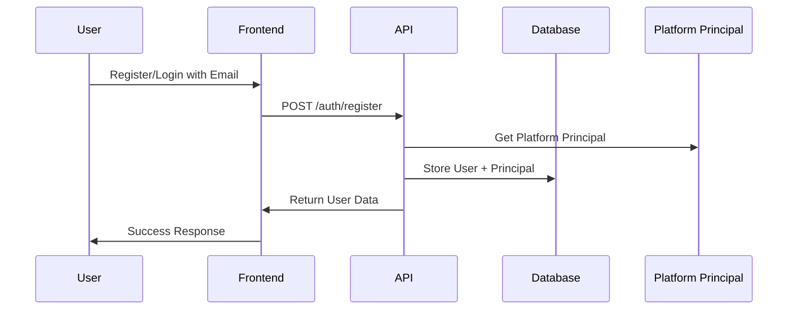
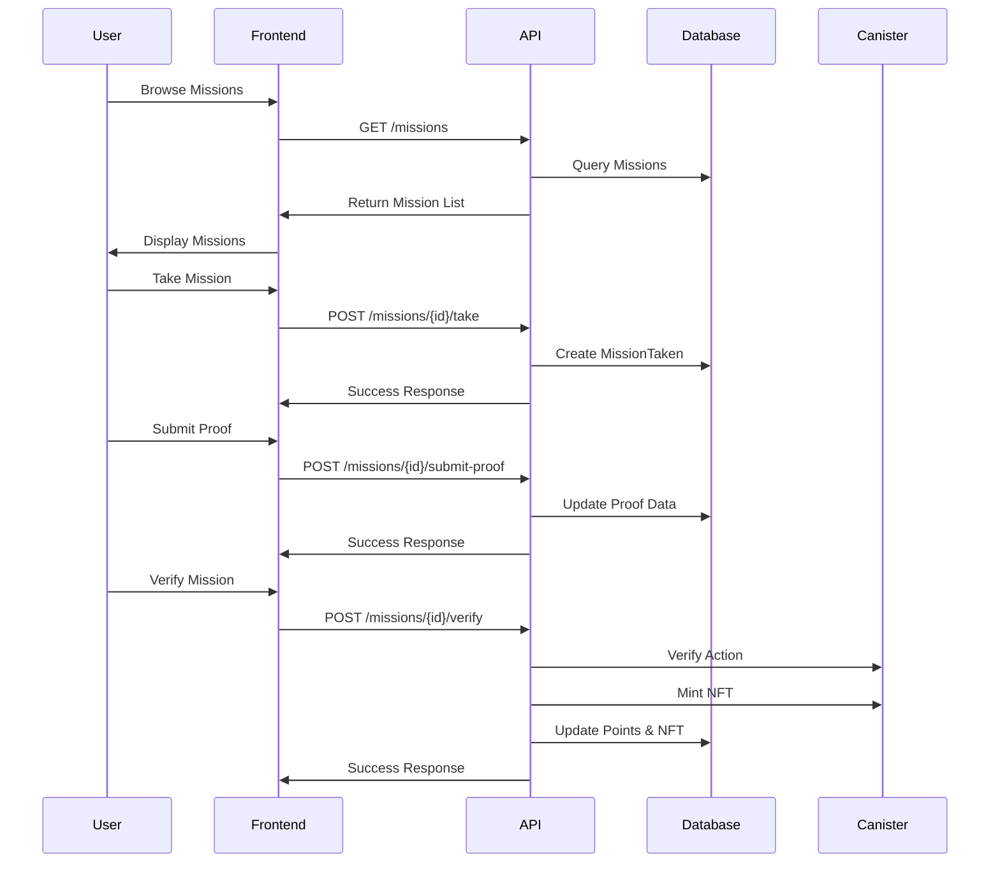
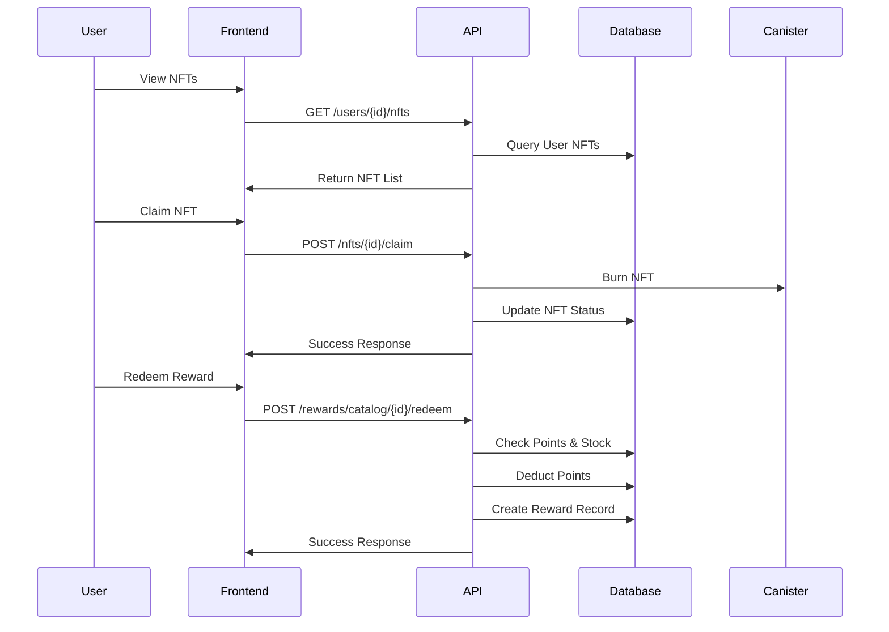

# PeduliCarbon - Carbon Offset NFT Platform

PeduliCarbon adalah platform inovatif yang mengubah aksi lingkungan komunitas menjadi aset digital (NFT Karbon) yang dapat diverifikasi dan diperjualbelikan di blockchain Internet Computer (ICP). Platform ini mendorong masyarakat untuk melakukan aksi ramah lingkungan dan mendapatkan reward berupa NFT dan poin yang dapat ditukar dengan hadiah.

## 🌟 Fitur Utama

### 🚀 Core Features
- **User Management**: Registrasi dan login dengan email, principal disimpan di database
- **Mission System**: Ambil dan selesaikan misi harian ramah lingkungan
- **Proof Verification**: Verifikasi aksi dengan foto, GPS, dan OCR
- **NFT Minting**: Mint NFT Karbon di blockchain ICP
- **Digital Wallet**: Kelola NFT, poin, dan saldo
- **Reward Marketplace**: Tukar poin dengan hadiah dan penarikan saldo

### 🎯 User Journey
1. **Onboarding** → Daftar/login dengan email, principal otomatis dari platform
2. **Mission Selection** → Pilih misi harian (naik KRL, bersepeda, dll)
3. **Action Verification** → Upload bukti (foto, GPS, OCR)
4. **NFT Minting** → Dapatkan NFT Karbon di blockchain
5. **Reward Collection** → Poin dan NFT masuk ke dompet
6. **Redemption** → Tukar poin dengan voucher atau tarik saldo

## 🏗️ Arsitektur Sistem

### High-Level Architecture


### Detailed System Design

#### 1. **Authentication Flow**


#### 2. **Mission Flow**


#### 3. **NFT & Reward Flow**


### Database Schema Design

#### Core Tables
```sql
-- Users table
users (
    id SERIAL PRIMARY KEY,
    name VARCHAR(255) NOT NULL,
    email VARCHAR(255) UNIQUE NOT NULL,
    ii_principal VARCHAR(255) NOT NULL,  -- Platform principal
    points INTEGER DEFAULT 0,
    created_at TIMESTAMP DEFAULT NOW(),
    updated_at TIMESTAMP DEFAULT NOW()
)

-- Missions table
missions (
    id SERIAL PRIMARY KEY,
    title VARCHAR(255) NOT NULL,
    description TEXT,
    asset_type VARCHAR(50) NOT NULL,
    asset_amount DECIMAL(10,2) NOT NULL,
    points INTEGER NOT NULL,
    verification_type VARCHAR(50) NOT NULL,
    status VARCHAR(50) DEFAULT 'active',
    created_at TIMESTAMP DEFAULT NOW(),
    updated_at TIMESTAMP DEFAULT NOW()
)

-- Mission Taken table
mission_taken (
    id SERIAL PRIMARY KEY,
    user_id INTEGER REFERENCES users(id),
    mission_id INTEGER REFERENCES missions(id),
    status VARCHAR(50) DEFAULT 'taken',
    proof_url TEXT,
    gps VARCHAR(255),
    created_at TIMESTAMP DEFAULT NOW(),
    updated_at TIMESTAMP DEFAULT NOW()
)

-- User NFTs table
user_nft (
    id SERIAL PRIMARY KEY,
    user_id INTEGER REFERENCES users(id),
    nft_id VARCHAR(255) UNIQUE NOT NULL,
    status VARCHAR(50) DEFAULT 'owned',
    claimed_by INTEGER REFERENCES users(id),
    claimed_at TIMESTAMP,
    certificate_url TEXT,
    created_at TIMESTAMP DEFAULT NOW()
)

-- Reward Catalog table
reward_catalog (
    id SERIAL PRIMARY KEY,
    name VARCHAR(255) NOT NULL,
    description TEXT,
    points_required INTEGER NOT NULL,
    stock INTEGER NOT NULL,
    type VARCHAR(50) NOT NULL,
    status VARCHAR(50) DEFAULT 'active',
    created_at TIMESTAMP DEFAULT NOW(),
    updated_at TIMESTAMP DEFAULT NOW()
)

-- Rewards table
rewards (
    id SERIAL PRIMARY KEY,
    user_id INTEGER REFERENCES users(id),
    mission_id INTEGER DEFAULT 0,
    points INTEGER NOT NULL,
    asset_type VARCHAR(50) NOT NULL,
    asset_amount DECIMAL(10,2) DEFAULT 0,
    status VARCHAR(50) DEFAULT 'redeemed',
    created_at TIMESTAMP DEFAULT NOW(),
    updated_at TIMESTAMP DEFAULT NOW()
)
```

### Security Architecture

#### 1. **Authentication & Authorization**
- **Email-based authentication** dengan principal platform
- **Principal validation** untuk aksi blockchain
- **Session management** via database
- **Rate limiting** untuk API endpoints

#### 2. **Data Security**
- **Database encryption** untuk sensitive data
- **HTTPS/TLS** untuk semua communications
- **Input validation** dan sanitization
- **SQL injection prevention** via GORM

#### 3. **Blockchain Security**
- **Principal verification** sebelum canister calls
- **Fallback mechanisms** untuk local development
- **Error handling** untuk canister failures
- **Audit trails** untuk semua blockchain transactions

### Performance Architecture

#### 1. **Database Optimization**
- **Indexes** pada foreign keys dan frequently queried columns
- **Connection pooling** untuk database connections
- **Query optimization** dengan GORM
- **Caching strategy** untuk static data

#### 2. **API Performance**
- **Response caching** untuk GET requests
- **Pagination** untuk large datasets
- **Async processing** untuk heavy operations
- **Load balancing** ready architecture

#### 3. **Blockchain Integration**
- **Fallback mechanisms** untuk local testing
- **Retry logic** untuk failed canister calls
- **Batch processing** untuk multiple operations
- **Monitoring** untuk canister performance

### Tech Stack
- **Backend**: Go (Gin framework)
- **Database**: PostgreSQL (GORM)
- **Blockchain**: Internet Computer (Motoko)
- **Authentication**: Email-based dengan principal platform
- **API Documentation**: OpenAPI 3.0

## 🚀 Quick Start

### Prerequisites
- Go 1.21+
- PostgreSQL 13+
- DFX SDK (untuk ICP development)
- Email service (untuk authentication)

### 1. Clone Repository
```bash
git clone <repository-url>
cd pedulicarbon
```

### 2. Setup Environment
```bash
# Copy environment template
cp .env.example .env

# Edit .env file dengan konfigurasi Anda
nano .env
```

**Environment Variables:**
```env
# Database
DB_HOST=localhost
DB_USER=postgres
DB_PASSWORD=your_password
DB_NAME=pedulicarbon
DB_PORT=5432

# ICP Configuration
ICP_PRINCIPAL_ID=your_icp_principal
ICP_CANISTER_HOST=http://localhost:4943
ICP_CANISTER_ID=your_canister_id

# Identity (untuk local development)
IDENTITY_PATH=~/.config/dfx/identity/pedulicarbon/identity.pem
IDENTITY_PASSPHRASE=pedulicarbon

# Server
PORT=8080
```

### 3. Setup Database
```bash
# Create database
createdb pedulicarbon

# Run migrations (auto-migrate saat startup)
go run main.go
```

### 4. Deploy Motoko Canister (Local)
```bash
# Start local replica
dfx start --background

# Deploy canister
cd motoko/pedulicarbon
dfx deploy

# Get canister ID
dfx canister id pedulicarbon
```

### 5. Run Backend
```bash
go run main.go
```

Server akan berjalan di `http://localhost:8080`

## 📖 User Flow & API Endpoints

### 1. User Registration & Authentication

#### Register User
```bash
curl -X POST http://localhost:8080/auth/register \
  -H "Content-Type: application/json" \
  -d '{
    "name": "John Doe",
    "email": "john@example.com",
    "password": "password123"
  }'
```

**Response:**
```json
{
  "message": "User registered successfully",
  "user": {
    "id": 1,
    "name": "John Doe",
    "email": "john@example.com",
    "ii_principal": "yxsh3-fgghl-hriy4-rd6rn-5tytj-2mbiu-hpxkd-dtnbd-5bzif-6f24l-aqe",
    "points": 0,
    "created_at": "2025-07-02T22:55:26.420198Z"
  }
}
```

#### Login User
```bash
curl -X POST http://localhost:8080/auth/login \
  -H "Content-Type: application/json" \
  -d '{
    "email": "john@example.com"
  }'
```

### 2. Mission Management

#### Create Mission (Admin)
```bash
curl -X POST http://localhost:8080/missions \
  -H "Content-Type: application/json" \
  -d '{
    "title": "Naik KRL ke Kantor",
    "description": "Pergi ke kantor menggunakan KRL untuk mengurangi emisi karbon",
    "asset_type": "NFT",
    "asset_amount": 1.5,
    "points": 10,
    "verification_type": "photo"
  }'
```

#### List Missions
```bash
curl -X GET http://localhost:8080/missions
```

#### Take Mission
```bash
curl -X POST http://localhost:8080/missions/1/take \
  -H "Content-Type: application/json" \
  -d '{
    "user_id": 1
  }'
```

### 3. Mission Execution

#### Submit Proof
```bash
curl -X POST http://localhost:8080/missions/1/submit-proof \
  -H "Content-Type: application/json" \
  -d '{
    "user_id": 1,
    "proof_url": "https://example.com/proof.jpg",
    "gps": "-6.2088,106.8456"
  }'
```

#### Verify Mission
```bash
curl -X POST http://localhost:8080/missions/1/verify \
  -H "Content-Type: application/json" \
  -d '{
    "user_id": 1
  }'
```

**Response:**
```json
{
  "status": "mission verified"
}
```

### 4. NFT Management

#### List User NFTs
```bash
curl -X GET http://localhost:8080/users/1/nfts
```

**Response:**
```json
{
  "nfts": [
    {
      "id": 1,
      "user_id": 1,
      "nft_id": "NFT-1751498546",
      "status": "owned",
      "claimed_by": null,
      "claimed_at": null,
      "certificate_url": "",
      "created_at": "2025-07-02T23:22:26.839329Z"
    }
  ]
}
```

#### Claim NFT
```bash
curl -X POST http://localhost:8080/nfts/NFT-1751498546/claim \
  -H "Content-Type: application/json" \
  -d '{
    "user_id": 1,
    "certificate_url": "https://example.com/certificate.pdf"
  }'
```

### 5. Reward System

#### Create Reward Catalog
```bash
curl -X POST http://localhost:8080/rewards/catalog \
  -H "Content-Type: application/json" \
  -d '{
    "name": "Voucher GoPay Rp 50.000",
    "description": "Voucher untuk transaksi GoPay",
    "points_required": 20,
    "stock": 100,
    "type": "voucher"
  }'
```

#### Redeem Reward
```bash
curl -X POST http://localhost:8080/rewards/catalog/1/redeem \
  -H "Content-Type: application/json" \
  -d '{
    "user_id": 1
  }'
```

#### Get User Rewards
```bash
curl -X GET http://localhost:8080/rewards/user/1
```

### 6. User Profile & Wallet

#### Get User Profile
```bash
curl -X GET http://localhost:8080/users/profile/1
```

**Response:**
```json
{
  "user": {
    "id": 1,
    "name": "John Doe",
    "email": "john@example.com",
    "ii_principal": "yxsh3-fgghl-hriy4-rd6rn-5tytj-2mbiu-hpxkd-dtnbd-5bzif-6f24l-aqe",
    "points": 10,
    "created_at": "2025-07-02T22:55:26.420198Z",
    "updated_at": "2025-07-02T23:26:59.485325Z"
  }
}
```

## 🔧 Development & Testing

### Local Development
```bash
# Run with hot reload (gunakan air)
go install github.com/cosmtrek/air@latest
air

# Run tests
go test ./...

# Check code coverage
go test -cover ./...
```

### End-to-End Testing
```bash
# Test complete user flow
./scripts/test-e2e.sh
```

### Database Management
```bash
# Reset database
dropdb pedulicarbon && createdb pedulicarbon

# View database schema
psql -d pedulicarbon -c "\d+"
```

## 🚀 Deployment

### Production Deployment

#### 1. Deploy Motoko Canister to Mainnet
```bash
# Deploy to ICP mainnet
dfx deploy --network ic

# Get canister ID
dfx canister id pedulicarbon --network ic
```

#### 2. Update Environment Variables
```env
ICP_CANISTER_HOST=https://ic0.app
ICP_CANISTER_ID=<your_mainnet_canister_id>
```

#### 3. Deploy Go Backend
```bash
# Build binary
go build -o pedulicarbon main.go

# Run with production config
./pedulicarbon
```

### Docker Deployment
```bash
# Build image
docker build -t pedulicarbon .

# Run container
docker run -p 8080:8080 --env-file .env pedulicarbon
```

## 📊 API Documentation

### Complete API Reference
Lihat file `docs/api_openapi.yaml` untuk dokumentasi API lengkap dengan OpenAPI 3.0 specification.

### API Endpoints Summary

| Method | Endpoint | Description |
|--------|----------|-------------|
| POST | `/auth/register` | Register new user |
| POST | `/auth/login` | User login |
| GET | `/users/profile/{id}` | Get user profile |
| GET | `/missions` | List all missions |
| POST | `/missions` | Create mission |
| POST | `/missions/{id}/take` | Take mission |
| POST | `/missions/{id}/submit-proof` | Submit proof |
| POST | `/missions/{id}/verify` | Verify mission |
| GET | `/users/{id}/nfts` | List user NFTs |
| POST | `/nfts/{id}/claim` | Claim NFT |
| POST | `/rewards/catalog` | Create reward catalog |
| POST | `/rewards/catalog/{id}/redeem` | Redeem reward |
| GET | `/rewards/user/{id}` | Get user rewards |

## 🔒 Security & Authentication

### Internet Identity Integration
- Platform menggunakan Internet Identity (ICP) untuk authentication
- User principal disimpan di database untuk verifikasi
- Semua aksi penting diverifikasi melalui Motoko canister

### Data Privacy
- User data disimpan di PostgreSQL database
- NFT data disimpan di Internet Computer blockchain
- Sensitive data dienkripsi

## 🐛 Troubleshooting

### Common Issues

#### 1. Database Connection Error
```bash
# Check PostgreSQL status
sudo systemctl status postgresql

# Check connection
psql -h localhost -U postgres -d pedulicarbon
```

#### 2. ICP Canister Not Found
```bash
# Check canister status
dfx canister status pedulicarbon

# Redeploy canister
dfx deploy
```

#### 3. Identity PEM Error
```bash
# Export identity
dfx identity export pedulicarbon > identity.pem

# Check identity format
openssl rsa -in identity.pem -check
```

### Debug Mode
```bash
# Enable debug logging
export DEBUG_MODE=true
go run main.go
```

## 🤝 Contributing

1. Fork repository
2. Create feature branch (`git checkout -b feature/amazing-feature`)
3. Commit changes (`git commit -m 'Add amazing feature'`)
4. Push to branch (`git push origin feature/amazing-feature`)
5. Open Pull Request


## 🆘 Support

- **Documentation**: [docs/](docs/)
- **API Reference**: [docs/api_openapi.yaml](docs/api_openapi.yaml)
- **Issues**: [GitHub Issues](https://github.com/your-repo/pedulicarbon/issues)

## 🎯 Roadmap

- [ ] Mobile App (React Native)
- [ ] Advanced Verification (AI/ML)
- [ ] Carbon Credit Marketplace
- [ ] Social Features
- [ ] Gamification
- [ ] Multi-chain Support

---

**PeduliCarbon** - Making environmental actions valuable through blockchain technology 🌱 