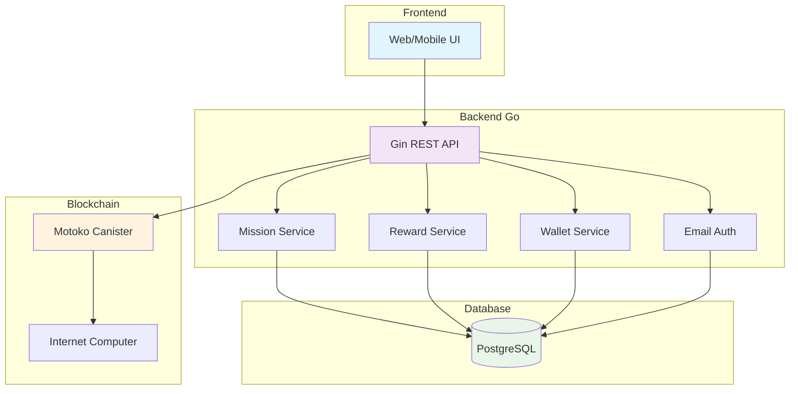
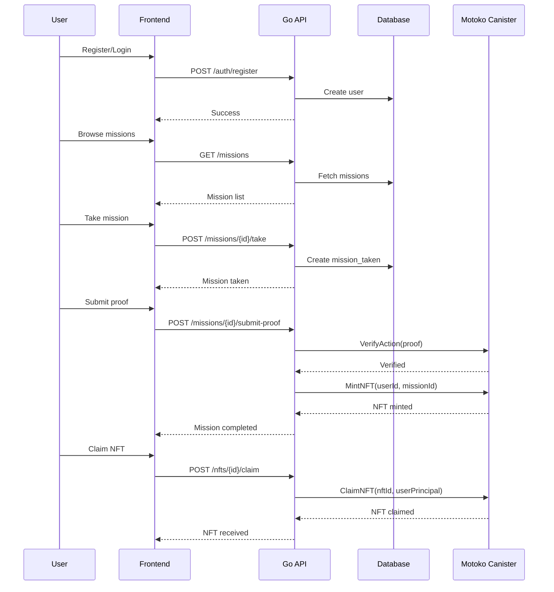
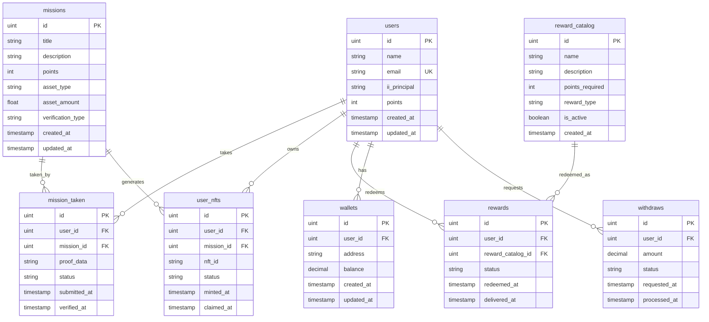

# PeduliCarbon 🌱

Platform carbon offset yang menggamifikasi aksi lingkungan dengan NFT dan points di Internet Computer blockchain.

## 🏗️ Arsitektur Sistem



## 🎯 Fitur Utama

- **🌱 Carbon Offset Missions**: Selesaikan tantangan lingkungan
- **🎨 NFT Rewards**: Dapatkan NFT unik untuk misi selesai
- **🏆 Point System**: Kumpulkan points untuk rewards
- **💼 Digital Wallet**: Kelola carbon credits
- **🔐 Email Authentication**: Login dengan email + password

## 🚀 Quick Start

### Prerequisites

- Go 1.21+
- PostgreSQL 15+
- dfx (Internet Computer SDK)

### Installation

1. **Clone repository**
   ```bash
   git clone https://github.com/yourusername/pedulicarbon.git
   cd pedulicarbon
   ```

2. **Setup environment variables**
   ```bash
   cp .env.example .env
   # Edit .env dengan konfigurasi kamu
   ```

3. **Start dependencies**
   ```bash
   # Start PostgreSQL
   docker-compose up -d
   
   # Start local ICP replica
   dfx start --background
   ```

4. **Deploy Motoko canister**
   ```bash
   cd motoko/pedulicarbon
   dfx deploy
   ```

5. **Run aplikasi**
   ```bash
   go run main.go
   ```

## 📊 User Flow



## 🗄️ Database Schema



## 🔧 API Endpoints

### Authentication
- `POST /auth/register` - User registration
- `POST /auth/login` - User login
- `GET /users/profile/:id` - Get user profile

### Missions
- `GET /missions` - List all missions
- `GET /missions/:id` - Get specific mission
- `POST /missions` - Create new mission
- `POST /missions/:id/take` - Take a mission
- `POST /missions/:id/submit-proof` - Submit mission proof
- `POST /missions/:id/verify` - Verify mission
- `GET /users/:user_id/missions` - Get user's taken missions

### NFTs
- `GET /users/:user_id/nfts` - List user's NFTs
- `POST /nfts/:id/claim` - Claim an NFT

### Rewards
- `GET /rewards/catalog` - List reward catalog
- `POST /rewards/catalog/:id/redeem` - Redeem a reward
- `GET /rewards/user/:user_id` - Get user's rewards

### Wallet
- `GET /wallets/user/:user_id` - Get user wallet
- `POST /wallets` - Create wallet
- `PUT /wallets` - Update wallet
- `POST /wallets/withdraw` - Request withdrawal

## 🛠️ Technology Stack

- **Backend**: Go 1.21+ dengan Gin framework
- **Database**: PostgreSQL dengan GORM
- **Blockchain**: Internet Computer (Motoko)
- **Authentication**: Email-based dengan JWT
- **Agent**: agent-go untuk komunikasi dengan ICP

## 📁 Project Structure

```
pedulicarbon/
├── 📁 docs/                    # Documentation
├── 📁 internal/                # Go application code
│   ├── 📁 api/                 # HTTP handlers
│   ├── 📁 model/               # Data models
│   ├── 📁 repository/          # Data access layer
│   ├── 📁 service/             # Business logic
│   └── 📁 motoko/              # Motoko client
├── 📁 motoko/                  # Motoko canister
├── 📄 main.go                  # Application entry point
├── 📄 go.mod                   # Go dependencies
└── 📄 README.md                # This file
```

## 🚀 Deployment

### Local Development
```bash
# Start all services
docker-compose up -d
dfx start --background
dfx deploy

# Run application
go run main.go
```

### Environment Variables
```bash
# Database
DB_HOST=localhost
DB_USER=postgres
DB_PASSWORD=password
DB_NAME=pedulicarbon
DB_PORT=5432

# Internet Computer
ICP_CANISTER_HOST=http://localhost:4943
ICP_CANISTER_ID=rrkah-fqaaa-aaaaa-aaaaq-cai
ICP_PRINCIPAL_ID=your-principal-id

# Identity (untuk agent-go)
IDENTITY_PATH=./identity.pem
IDENTITY_PASSPHRASE=pedulicarbon
```

## 🧪 Testing

### End-to-End Testing
```bash
# Test complete user flow
go run test-agent.go
```

## 📚 Documentation

- [📖 API Documentation](docs/api_openapi.yaml) - Complete API specification
- [🚀 Deployment Guide](docs/DEPLOYMENT.md) - Production deployment instructions
- [🔗 Frontend Integration](docs/FRONTEND_INTEGRATION.md) - Frontend integration guide
- [🛠️ Troubleshooting](docs/TROUBLESHOOTING.md) - Common issues and solutions

## 🤝 Contributing

1. Fork the repository
2. Create a feature branch (`git checkout -b feature/amazing-feature`)
3. Commit your changes (`git commit -m 'Add amazing feature'`)
4. Push to the branch (`git push origin feature/amazing-feature`)
5. Open a Pull Request

## 📞 Support

- **Issues**: [GitHub Issues](https://github.com/yourusername/pedulicarbon/issues)
- **Email**: support@pedulicarbon.com

---

**Made with ❤️ for a greener future** 🌍 