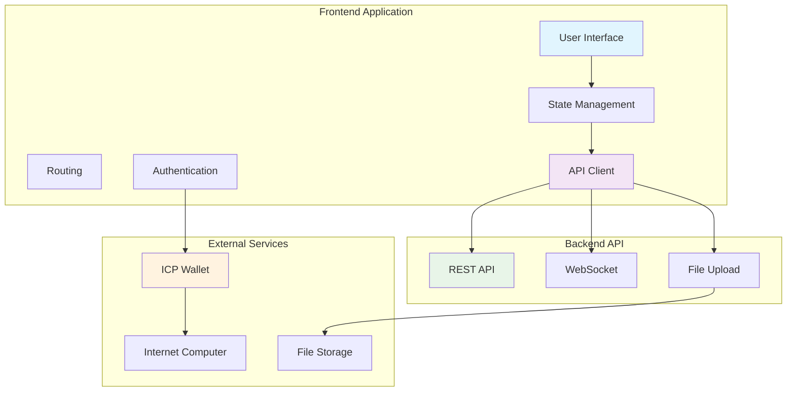
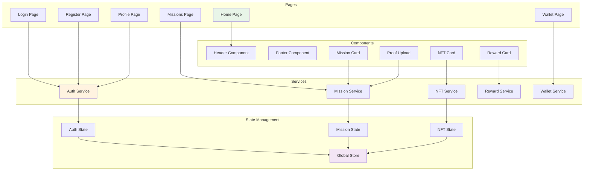
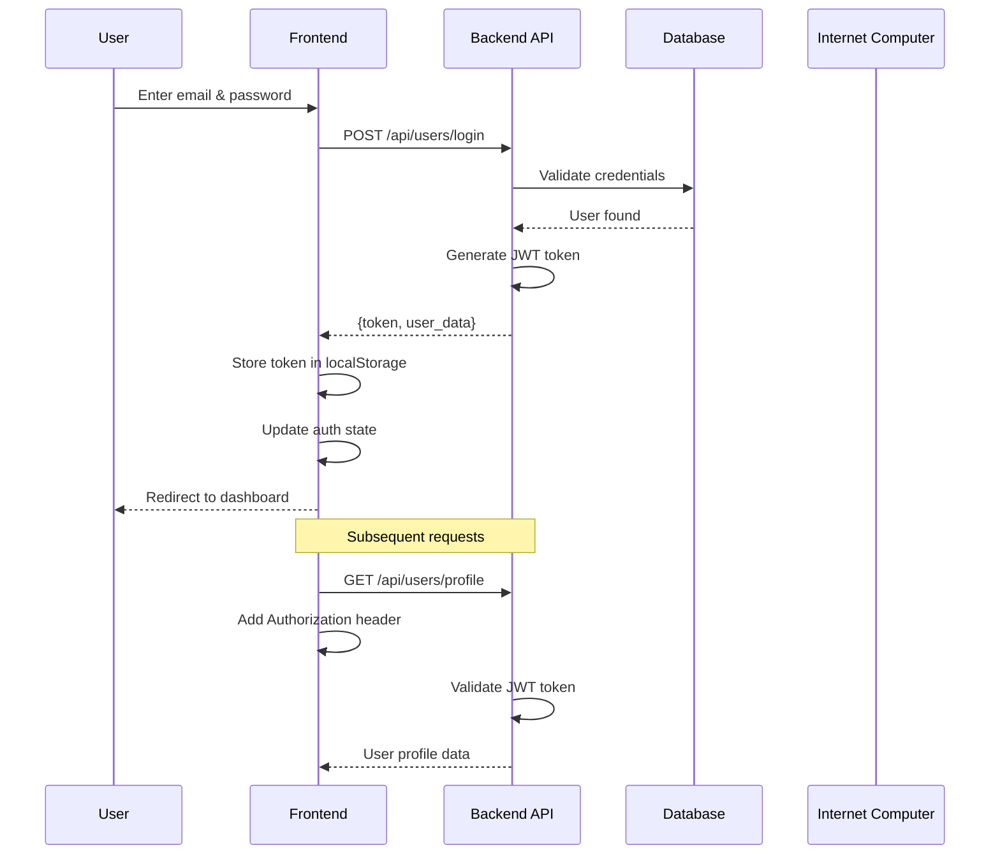

# Frontend Integration Guide

This guide provides comprehensive instructions for integrating frontend applications with the PeduliCarbon backend API.

## 🔗 Integration Overview



## 🏗️ Component Architecture



## 🔐 Authentication Flow



## 📡 API Integration Patterns

### 1. REST API Client Setup

```javascript
// api/client.js
class APIClient {
  constructor(baseURL) {
    this.baseURL = baseURL;
    this.token = localStorage.getItem('token');
  }

  async request(endpoint, options = {}) {
    const url = `${this.baseURL}${endpoint}`;
    const config = {
      headers: {
        'Content-Type': 'application/json',
        ...(this.token && { Authorization: `Bearer ${this.token}` }),
        ...options.headers,
      },
      ...options,
    };

    try {
      const response = await fetch(url, config);
      if (!response.ok) {
        throw new Error(`HTTP ${response.status}: ${response.statusText}`);
      }
      return await response.json();
    } catch (error) {
      console.error('API request failed:', error);
      throw error;
    }
  }

  // Authentication methods
  async login(email, password) {
    return this.request('/api/users/login', {
      method: 'POST',
      body: JSON.stringify({ email, password }),
    });
  }

  async register(userData) {
    return this.request('/api/users/register', {
      method: 'POST',
      body: JSON.stringify(userData),
    });
  }

  // Mission methods
  async getMissions() {
    return this.request('/api/missions');
  }

  async takeMission(missionId) {
    return this.request(`/api/missions/${missionId}/take`, {
      method: 'POST',
    });
  }

  async submitProof(missionId, proofData) {
    return this.request(`/api/missions/${missionId}/submit-proof`, {
      method: 'POST',
      body: JSON.stringify(proofData),
    });
  }

  // NFT methods
  async getNFTs() {
    return this.request('/api/nfts');
  }

  async claimNFT(nftId) {
    return this.request(`/api/nfts/${nftId}/claim`, {
      method: 'POST',
    });
  }

  // Reward methods
  async getRewardCatalog() {
    return this.request('/api/rewards/catalog');
  }

  async redeemReward(rewardId) {
    return this.request('/api/rewards/redeem', {
      method: 'POST',
      body: JSON.stringify({ reward_catalog_id: rewardId }),
    });
  }
}
```

### 2. State Management Integration

```javascript
// store/index.js
class PeduliCarbonStore {
  constructor() {
    this.state = {
      user: null,
      missions: [],
      nfts: [],
      rewards: [],
      loading: false,
      error: null,
    };
    this.listeners = [];
  }

  subscribe(listener) {
    this.listeners.push(listener);
    return () => {
      this.listeners = this.listeners.filter(l => l !== listener);
    };
  }

  notify() {
    this.listeners.forEach(listener => listener(this.state));
  }

  setState(newState) {
    this.state = { ...this.state, ...newState };
    this.notify();
  }

  // Actions
  async login(email, password) {
    this.setState({ loading: true, error: null });
    try {
      const response = await apiClient.login(email, password);
      this.setState({ user: response.user, loading: false });
      localStorage.setItem('token', response.token);
    } catch (error) {
      this.setState({ error: error.message, loading: false });
    }
  }

  async loadMissions() {
    this.setState({ loading: true });
    try {
      const missions = await apiClient.getMissions();
      this.setState({ missions, loading: false });
    } catch (error) {
      this.setState({ error: error.message, loading: false });
    }
  }

  async takeMission(missionId) {
    try {
      await apiClient.takeMission(missionId);
      // Refresh missions to update status
      await this.loadMissions();
    } catch (error) {
      this.setState({ error: error.message });
    }
  }
}
```

## 🎯 Mission Integration

### Mission List Component

```javascript
// components/MissionList.js
class MissionList extends Component {
  constructor(props) {
    super(props);
    this.state = {
      missions: [],
      loading: false,
      error: null,
    };
  }

  async componentDidMount() {
    await this.loadMissions();
  }

  async loadMissions() {
    this.setState({ loading: true });
    try {
      const missions = await apiClient.getMissions();
      this.setState({ missions, loading: false });
    } catch (error) {
      this.setState({ error: error.message, loading: false });
    }
  }

  async handleTakeMission(missionId) {
    try {
      await apiClient.takeMission(missionId);
      // Show success message and refresh
      this.showNotification('Mission taken successfully!', 'success');
      await this.loadMissions();
    } catch (error) {
      this.showNotification(error.message, 'error');
    }
  }

  render() {
    const { missions, loading, error } = this.state;

    if (loading) return <LoadingSpinner />;
    if (error) return <ErrorMessage message={error} />;

    return (
      <div className="mission-list">
        <h2>Available Missions</h2>
        <div className="missions-grid">
          {missions.map(mission => (
            <MissionCard
              key={mission.id}
              mission={mission}
              onTakeMission={() => this.handleTakeMission(mission.id)}
            />
          ))}
        </div>
      </div>
    );
  }
}
```

### Mission Card Component

```javascript
// components/MissionCard.js
class MissionCard extends Component {
  render() {
    const { mission, onTakeMission } = this.props;
    const { title, description, carbon_offset, points_reward, status } = mission;

    return (
      <div className="mission-card">
        <div className="mission-header">
          <h3>{title}</h3>
          <span className={`status ${status}`}>{status}</span>
        </div>
        
        <div className="mission-content">
          <p>{description}</p>
          
          <div className="mission-rewards">
            <div className="reward-item">
              <span className="icon">🌱</span>
              <span>{carbon_offset} kg CO2</span>
            </div>
            <div className="reward-item">
              <span className="icon">🏆</span>
              <span>{points_reward} points</span>
            </div>
          </div>
        </div>
        
        <div className="mission-actions">
          {status === 'available' && (
            <button 
              className="btn btn-primary"
              onClick={onTakeMission}
            >
              Take Mission
            </button>
          )}
          
          {status === 'taken' && (
            <button 
              className="btn btn-secondary"
              onClick={() => this.props.onSubmitProof(mission.id)}
            >
              Submit Proof
            </button>
          )}
          
          {status === 'completed' && (
            <span className="completed-badge">✅ Completed</span>
          )}
        </div>
      </div>
    );
  }
}
```

## 🎨 NFT Integration

### NFT Gallery Component

```javascript
// components/NFTGallery.js
class NFTGallery extends Component {
  constructor(props) {
    super(props);
    this.state = {
      nfts: [],
      loading: false,
      error: null,
    };
  }

  async componentDidMount() {
    await this.loadNFTs();
  }

  async loadNFTs() {
    this.setState({ loading: true });
    try {
      const nfts = await apiClient.getNFTs();
      this.setState({ nfts, loading: false });
    } catch (error) {
      this.setState({ error: error.message, loading: false });
    }
  }

  async handleClaimNFT(nftId) {
    try {
      await apiClient.claimNFT(nftId);
      this.showNotification('NFT claimed successfully!', 'success');
      await this.loadNFTs();
    } catch (error) {
      this.showNotification(error.message, 'error');
    }
  }

  render() {
    const { nfts, loading, error } = this.state;

    if (loading) return <LoadingSpinner />;
    if (error) return <ErrorMessage message={error} />;

    return (
      <div className="nft-gallery">
        <h2>My NFTs</h2>
        <div className="nfts-grid">
          {nfts.map(nft => (
            <NFTCard
              key={nft.id}
              nft={nft}
              onClaimNFT={() => this.handleClaimNFT(nft.id)}
            />
          ))}
        </div>
      </div>
    );
  }
}
```

## 🏆 Reward Integration

### Reward Catalog Component

```javascript
// components/RewardCatalog.js
class RewardCatalog extends Component {
  constructor(props) {
    super(props);
    this.state = {
      rewards: [],
      userPoints: 0,
      loading: false,
      error: null,
    };
  }

  async componentDidMount() {
    await Promise.all([
      this.loadRewards(),
      this.loadUserPoints(),
    ]);
  }

  async loadRewards() {
    this.setState({ loading: true });
    try {
      const rewards = await apiClient.getRewardCatalog();
      this.setState({ rewards, loading: false });
    } catch (error) {
      this.setState({ error: error.message, loading: false });
    }
  }

  async loadUserPoints() {
    try {
      const profile = await apiClient.getProfile();
      this.setState({ userPoints: profile.points });
    } catch (error) {
      console.error('Failed to load user points:', error);
    }
  }

  async handleRedeemReward(rewardId) {
    try {
      await apiClient.redeemReward(rewardId);
      this.showNotification('Reward redeemed successfully!', 'success');
      await this.loadUserPoints();
    } catch (error) {
      this.showNotification(error.message, 'error');
    }
  }

  render() {
    const { rewards, userPoints, loading, error } = this.state;

    if (loading) return <LoadingSpinner />;
    if (error) return <ErrorMessage message={error} />;

    return (
      <div className="reward-catalog">
        <div className="points-display">
          <h2>Reward Catalog</h2>
          <div className="user-points">
            <span className="icon">🏆</span>
            <span>{userPoints} points available</span>
          </div>
        </div>
        
        <div className="rewards-grid">
          {rewards.map(reward => (
            <RewardCard
              key={reward.id}
              reward={reward}
              userPoints={userPoints}
              onRedeem={() => this.handleRedeemReward(reward.id)}
            />
          ))}
        </div>
      </div>
    );
  }
}
```

## 📱 Mobile Integration

### Responsive Design Patterns

```css
/* styles/responsive.css */
.mission-card {
  display: flex;
  flex-direction: column;
  padding: 1rem;
  border-radius: 8px;
  box-shadow: 0 2px 4px rgba(0,0,0,0.1);
  transition: transform 0.2s;
}

.mission-card:hover {
  transform: translateY(-2px);
}

/* Mobile-first approach */
@media (max-width: 768px) {
  .missions-grid {
    grid-template-columns: 1fr;
    gap: 1rem;
  }
  
  .mission-card {
    margin-bottom: 1rem;
  }
  
  .mission-actions {
    flex-direction: column;
  }
  
  .btn {
    width: 100%;
    margin-bottom: 0.5rem;
  }
}

/* Tablet */
@media (min-width: 769px) and (max-width: 1024px) {
  .missions-grid {
    grid-template-columns: repeat(2, 1fr);
  }
}

/* Desktop */
@media (min-width: 1025px) {
  .missions-grid {
    grid-template-columns: repeat(3, 1fr);
  }
}
```

## 🔄 Real-time Updates

### WebSocket Integration

```javascript
// services/websocket.js
class WebSocketService {
  constructor() {
    this.ws = null;
    this.reconnectAttempts = 0;
    this.maxReconnectAttempts = 5;
  }

  connect(token) {
    const wsUrl = `${process.env.REACT_APP_WS_URL}?token=${token}`;
    
    this.ws = new WebSocket(wsUrl);
    
    this.ws.onopen = () => {
      console.log('WebSocket connected');
      this.reconnectAttempts = 0;
    };
    
    this.ws.onmessage = (event) => {
      const data = JSON.parse(event.data);
      this.handleMessage(data);
    };
    
    this.ws.onclose = () => {
      console.log('WebSocket disconnected');
      this.attemptReconnect();
    };
    
    this.ws.onerror = (error) => {
      console.error('WebSocket error:', error);
    };
  }

  handleMessage(data) {
    switch (data.type) {
      case 'mission_completed':
        this.notifyMissionCompleted(data.payload);
        break;
      case 'nft_minted':
        this.notifyNFTMinted(data.payload);
        break;
      case 'points_updated':
        this.notifyPointsUpdated(data.payload);
        break;
      default:
        console.log('Unknown message type:', data.type);
    }
  }

  attemptReconnect() {
    if (this.reconnectAttempts < this.maxReconnectAttempts) {
      this.reconnectAttempts++;
      setTimeout(() => {
        this.connect(localStorage.getItem('token'));
      }, 1000 * this.reconnectAttempts);
    }
  }

  disconnect() {
    if (this.ws) {
      this.ws.close();
    }
  }
}
```

## 🎨 UI/UX Best Practices

### Loading States

```javascript
// components/LoadingSpinner.js
class LoadingSpinner extends Component {
  render() {
    return (
      <div className="loading-spinner">
        <div className="spinner"></div>
        <p>Loading...</p>
      </div>
    );
  }
}

// components/SkeletonLoader.js
class SkeletonLoader extends Component {
  render() {
    return (
      <div className="skeleton-loader">
        <div className="skeleton-card">
          <div className="skeleton-title"></div>
          <div className="skeleton-content">
            <div className="skeleton-line"></div>
            <div className="skeleton-line"></div>
            <div className="skeleton-line"></div>
          </div>
          <div className="skeleton-button"></div>
        </div>
      </div>
    );
  }
}
```

### Error Handling

```javascript
// components/ErrorMessage.js
class ErrorMessage extends Component {
  render() {
    const { message, onRetry } = this.props;
    
    return (
      <div className="error-message">
        <div className="error-icon">⚠️</div>
        <h3>Something went wrong</h3>
        <p>{message}</p>
        {onRetry && (
          <button className="btn btn-primary" onClick={onRetry}>
            Try Again
          </button>
        )}
      </div>
    );
  }
}
```

### Success Notifications

```javascript
// components/Notification.js
class Notification extends Component {
  constructor(props) {
    super(props);
    this.state = {
      visible: false,
      message: '',
      type: 'info',
    };
  }

  show(message, type = 'info') {
    this.setState({ visible: true, message, type });
    setTimeout(() => {
      this.setState({ visible: false });
    }, 3000);
  }

  render() {
    const { visible, message, type } = this.state;
    
    if (!visible) return null;
    
    return (
      <div className={`notification notification-${type}`}>
        <span className="notification-message">{message}</span>
        <button 
          className="notification-close"
          onClick={() => this.setState({ visible: false })}
        >
          ×
        </button>
      </div>
    );
  }
}
```

## 🧪 Testing Integration

### API Mocking

```javascript
// tests/mocks/apiMock.js
export const mockAPI = {
  login: jest.fn().mockResolvedValue({
    token: 'mock-token',
    user: { id: '1', email: 'test@example.com', points: 100 }
  }),
  
  getMissions: jest.fn().mockResolvedValue([
    {
      id: '1',
      title: 'Plant a Tree',
      description: 'Plant a tree in your backyard',
      carbon_offset: 50,
      points_reward: 100,
      status: 'available'
    }
  ]),
  
  takeMission: jest.fn().mockResolvedValue({ success: true }),
  
  submitProof: jest.fn().mockResolvedValue({ success: true }),
  
  getNFTs: jest.fn().mockResolvedValue([
    {
      id: '1',
      nft_id: 'nft-123',
      status: 'minted',
      mission: { title: 'Plant a Tree' }
    }
  ]),
  
  claimNFT: jest.fn().mockResolvedValue({ success: true }),
  
  getRewardCatalog: jest.fn().mockResolvedValue([
    {
      id: '1',
      name: 'Eco-friendly Water Bottle',
      description: 'Reusable water bottle',
      points_required: 500,
      reward_type: 'physical'
    }
  ]),
  
  redeemReward: jest.fn().mockResolvedValue({ success: true })
};
```

### Component Testing

```javascript
// tests/components/MissionList.test.js
import { render, screen, fireEvent, waitFor } from '@testing-library/react';
import MissionList from '../../components/MissionList';
import { mockAPI } from '../mocks/apiMock';

jest.mock('../../services/api', () => mockAPI);

describe('MissionList', () => {
  beforeEach(() => {
    jest.clearAllMocks();
  });

  test('renders missions correctly', async () => {
    render(<MissionList />);
    
    await waitFor(() => {
      expect(screen.getByText('Plant a Tree')).toBeInTheDocument();
    });
  });

  test('handles take mission action', async () => {
    render(<MissionList />);
    
    await waitFor(() => {
      const takeButton = screen.getByText('Take Mission');
      fireEvent.click(takeButton);
    });
    
    expect(mockAPI.takeMission).toHaveBeenCalledWith('1');
  });

  test('handles errors gracefully', async () => {
    mockAPI.getMissions.mockRejectedValue(new Error('API Error'));
    
    render(<MissionList />);
    
    await waitFor(() => {
      expect(screen.getByText('Something went wrong')).toBeInTheDocument();
    });
  });
});
```

## 📊 Performance Optimization

### Code Splitting

```javascript
// App.js
import { lazy, Suspense } from 'react';

const MissionList = lazy(() => import('./components/MissionList'));
const NFTGallery = lazy(() => import('./components/NFTGallery'));
const RewardCatalog = lazy(() => import('./components/RewardCatalog'));

function App() {
  return (
    <div className="app">
      <Suspense fallback={<LoadingSpinner />}>
        <Switch>
          <Route path="/missions" component={MissionList} />
          <Route path="/nfts" component={NFTGallery} />
          <Route path="/rewards" component={RewardCatalog} />
        </Switch>
      </Suspense>
    </div>
  );
}
```

### Caching Strategy

```javascript
// services/cache.js
class CacheService {
  constructor() {
    this.cache = new Map();
    this.ttl = new Map();
  }

  set(key, value, ttlMs = 5 * 60 * 1000) { // 5 minutes default
    this.cache.set(key, value);
    this.ttl.set(key, Date.now() + ttlMs);
  }

  get(key) {
    if (!this.cache.has(key)) return null;
    
    const expiry = this.ttl.get(key);
    if (Date.now() > expiry) {
      this.delete(key);
      return null;
    }
    
    return this.cache.get(key);
  }

  delete(key) {
    this.cache.delete(key);
    this.ttl.delete(key);
  }

  clear() {
    this.cache.clear();
    this.ttl.clear();
  }
}

// Usage in API client
const cache = new CacheService();

class CachedAPIClient extends APIClient {
  async getMissions() {
    const cached = cache.get('missions');
    if (cached) return cached;
    
    const missions = await super.getMissions();
    cache.set('missions', missions);
    return missions;
  }
}
```

This comprehensive frontend integration guide provides visual diagrams, code examples, and best practices for integrating with the PeduliCarbon backend API. The diagrams help developers understand the architecture and flow, while the code examples provide practical implementation guidance. 