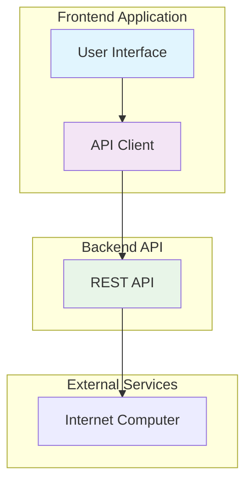
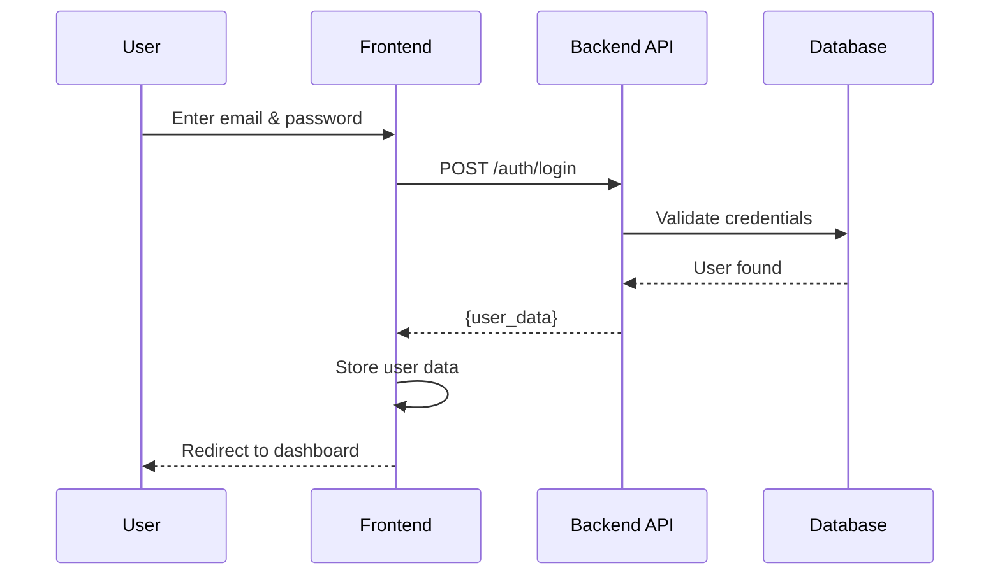

# Frontend Integration Guide

Panduan integrasi frontend dengan PeduliCarbon API. Platform ini menggunakan REST API dengan JSON responses dan email-based authentication.

## 🔗 Integration Overview



## 🔐 Authentication Flow



## 📡 API Integration

### 1. API Client Setup

```javascript
// api/client.js
class PeduliCarbonAPI {
  constructor(baseURL) {
    this.baseURL = baseURL || 'http://localhost:8080';
  }

  async request(endpoint, options = {}) {
    const url = `${this.baseURL}${endpoint}`;
    const config = {
      headers: {
        'Content-Type': 'application/json',
        ...options.headers,
      },
      ...options,
    };

    try {
      const response = await fetch(url, config);
      if (!response.ok) {
        throw new Error(`HTTP ${response.status}: ${response.statusText}`);
      }
      return await response.json();
    } catch (error) {
      console.error('API request failed:', error);
      throw error;
    }
  }

  // Authentication
  async register(userData) {
    return this.request('/auth/register', {
      method: 'POST',
      body: JSON.stringify(userData),
    });
  }

  async login(email, password) {
    return this.request('/auth/login', {
      method: 'POST',
      body: JSON.stringify({ email, password }),
    });
  }

  // Missions
  async getMissions() {
    return this.request('/missions');
  }

  async takeMission(missionId) {
    return this.request(`/missions/${missionId}/take`, {
      method: 'POST',
    });
  }

  async submitProof(missionId, proofData) {
    return this.request(`/missions/${missionId}/submit-proof`, {
      method: 'POST',
      body: JSON.stringify(proofData),
    });
  }

  // NFTs
  async getUserNFTs(userId) {
    return this.request(`/users/${userId}/nfts`);
  }

  async claimNFT(nftId) {
    return this.request(`/nfts/${nftId}/claim`, {
      method: 'POST',
    });
  }

  // Rewards
  async getRewardCatalog() {
    return this.request('/rewards/catalog');
  }

  async redeemReward(catalogId) {
    return this.request(`/rewards/catalog/${catalogId}/redeem`, {
      method: 'POST',
    });
  }
}
```

### 2. User Registration & Login

```javascript
// components/Auth/Register.js
import React, { useState } from 'react';
import api from '../../services/api';

const Register = () => {
  const [formData, setFormData] = useState({
    name: '',
    email: '',
    password: '',
  });
  const [loading, setLoading] = useState(false);
  const [error, setError] = useState(null);

  const handleSubmit = async (e) => {
    e.preventDefault();
    setLoading(true);
    setError(null);

    try {
      const response = await api.register(formData);
      localStorage.setItem('user', JSON.stringify(response.user));
      window.location.href = '/dashboard';
    } catch (error) {
      setError(error.message);
    } finally {
      setLoading(false);
    }
  };

  return (
    <form onSubmit={handleSubmit}>
      <input
        type="text"
        placeholder="Full Name"
        value={formData.name}
        onChange={(e) => setFormData({...formData, name: e.target.value})}
        required
      />
      <input
        type="email"
        placeholder="Email"
        value={formData.email}
        onChange={(e) => setFormData({...formData, email: e.target.value})}
        required
      />
      <input
        type="password"
        placeholder="Password"
        value={formData.password}
        onChange={(e) => setFormData({...formData, password: e.target.value})}
        required
      />
      <button type="submit" disabled={loading}>
        {loading ? 'Registering...' : 'Register'}
      </button>
      {error && <div className="error">{error}</div>}
    </form>
  );
};
```

### 3. Mission Management

```javascript
// components/Missions/MissionList.js
import React, { useState, useEffect } from 'react';
import api from '../../services/api';

const MissionList = () => {
  const [missions, setMissions] = useState([]);
  const [loading, setLoading] = useState(true);
  const [error, setError] = useState(null);

  useEffect(() => {
    loadMissions();
  }, []);

  const loadMissions = async () => {
    try {
      const response = await api.getMissions();
      setMissions(response);
    } catch (error) {
      setError(error.message);
    } finally {
      setLoading(false);
    }
  };

  const handleTakeMission = async (missionId) => {
    const user = JSON.parse(localStorage.getItem('user'));
    
    try {
      await api.takeMission(missionId);
      alert('Mission taken successfully!');
      loadMissions(); // Refresh missions
    } catch (error) {
      alert(`Error: ${error.message}`);
    }
  };

  if (loading) return <div>Loading missions...</div>;
  if (error) return <div>Error: {error}</div>;

  return (
    <div className="mission-list">
      <h2>Available Missions</h2>
      {missions.map(mission => (
        <div key={mission.id} className="mission-card">
          <h3>{mission.title}</h3>
          <p>{mission.description}</p>
          <div className="mission-details">
            <span>Points: {mission.points}</span>
            <span>Asset: {mission.asset_amount} {mission.asset_type}</span>
            <span>Verification: {mission.verification_type}</span>
          </div>
          <button onClick={() => handleTakeMission(mission.id)}>
            Take Mission
          </button>
        </div>
      ))}
    </div>
  );
};
```

### 4. Proof Submission

```javascript
// components/Missions/ProofSubmission.js
import React, { useState } from 'react';
import api from '../../services/api';

const ProofSubmission = ({ missionId, onSuccess }) => {
  const [proofData, setProofData] = useState({
    proof_url: '',
    gps: '',
  });
  const [loading, setLoading] = useState(false);
  const [error, setError] = useState(null);

  const handleSubmit = async (e) => {
    e.preventDefault();
    setLoading(true);
    setError(null);

    try {
      await api.submitProof(missionId, proofData);
      alert('Proof submitted successfully!');
      onSuccess && onSuccess();
    } catch (error) {
      setError(error.message);
    } finally {
      setLoading(false);
    }
  };

  return (
    <form onSubmit={handleSubmit}>
      <input
        type="url"
        placeholder="Proof URL (image/document)"
        value={proofData.proof_url}
        onChange={(e) => setProofData({...proofData, proof_url: e.target.value})}
        required
      />
      <input
        type="text"
        placeholder="GPS Coordinates (e.g., -6.2088,106.8456)"
        value={proofData.gps}
        onChange={(e) => setProofData({...proofData, gps: e.target.value})}
        required
      />
      <button type="submit" disabled={loading}>
        {loading ? 'Submitting...' : 'Submit Proof'}
      </button>
      {error && <div className="error">{error}</div>}
    </form>
  );
};
```

### 5. NFT Management

```javascript
// components/NFTs/NFTList.js
import React, { useState, useEffect } from 'react';
import api from '../../services/api';

const NFTList = () => {
  const [nfts, setNfts] = useState([]);
  const [loading, setLoading] = useState(true);
  const [error, setError] = useState(null);

  useEffect(() => {
    loadNFTs();
  }, []);

  const loadNFTs = async () => {
    const user = JSON.parse(localStorage.getItem('user'));
    
    try {
      const response = await api.getUserNFTs(user.id);
      setNfts(response.nfts);
    } catch (error) {
      setError(error.message);
    } finally {
      setLoading(false);
    }
  };

  const handleClaimNFT = async (nftId) => {
    try {
      await api.claimNFT(nftId);
      alert('NFT claimed successfully!');
      loadNFTs(); // Refresh NFT list
    } catch (error) {
      alert(`Error: ${error.message}`);
    }
  };

  if (loading) return <div>Loading NFTs...</div>;
  if (error) return <div>Error: {error}</div>;

  return (
    <div className="nft-list">
      <h2>My NFTs</h2>
      {nfts.map(nft => (
        <div key={nft.id} className="nft-card">
          <h3>NFT ID: {nft.nft_id}</h3>
          <p>Status: {nft.status}</p>
          <p>Created: {new Date(nft.created_at).toLocaleDateString()}</p>
          
          {nft.status === 'owned' && (
            <button onClick={() => handleClaimNFT(nft.nft_id)}>
              Claim NFT
            </button>
          )}
          
          {nft.status === 'claimed' && (
            <div>
              <p>Claimed: {new Date(nft.claimed_at).toLocaleDateString()}</p>
              <a href={nft.certificate_url} target="_blank" rel="noopener">
                View Certificate
              </a>
            </div>
          )}
        </div>
      ))}
    </div>
  );
};
```

### 6. Reward System

```javascript
// components/Rewards/RewardCatalog.js
import React, { useState, useEffect } from 'react';
import api from '../../services/api';

const RewardCatalog = () => {
  const [rewards, setRewards] = useState([]);
  const [user, setUser] = useState(null);
  const [loading, setLoading] = useState(true);
  const [error, setError] = useState(null);

  useEffect(() => {
    loadUserAndRewards();
  }, []);

  const loadUserAndRewards = async () => {
    const userData = JSON.parse(localStorage.getItem('user'));
    setUser(userData);

    try {
      const response = await api.getRewardCatalog();
      setRewards(response);
    } catch (error) {
      setError(error.message);
    } finally {
      setLoading(false);
    }
  };

  const handleRedeemReward = async (catalogId) => {
    try {
      await api.redeemReward(catalogId);
      alert('Reward redeemed successfully!');
      
      // Refresh user data to update points
      const updatedUser = await api.getUserProfile(user.id);
      setUser(updatedUser.user);
      localStorage.setItem('user', JSON.stringify(updatedUser.user));
    } catch (error) {
      alert(`Error: ${error.message}`);
    }
  };

  if (loading) return <div>Loading rewards...</div>;
  if (error) return <div>Error: {error}</div>;

  return (
    <div className="reward-catalog">
      <div className="user-points">
        <h3>Your Points: {user?.points || 0}</h3>
      </div>
      
      {rewards.map(reward => (
        <div key={reward.id} className="reward-card">
          <h3>{reward.name}</h3>
          <p>{reward.description}</p>
          <div className="reward-details">
            <span>Points Required: {reward.points_required}</span>
            <span>Type: {reward.reward_type}</span>
          </div>
          
          {user && user.points >= reward.points_required ? (
            <button onClick={() => handleRedeemReward(reward.id)}>
              Redeem Reward
            </button>
          ) : (
            <button disabled>
              {user && user.points < reward.points_required 
                ? 'Insufficient Points' 
                : 'Not Available'}
            </button>
          )}
        </div>
      ))}
    </div>
  );
};
```

## 🎨 UI/UX Best Practices

### Loading States
```javascript
const LoadingSpinner = () => (
  <div className="loading-spinner">
    <div className="spinner"></div>
    <p>Loading...</p>
  </div>
);
```

### Error Handling
```javascript
const ErrorMessage = ({ message, onRetry }) => (
  <div className="error-message">
    <h3>Something went wrong</h3>
    <p>{message}</p>
    {onRetry && (
      <button onClick={onRetry}>Try Again</button>
    )}
  </div>
);
```

### Form Validation
```javascript
const validateMissionProof = (proofData) => {
  const errors = {};

  if (!proofData.proof_url) {
    errors.proof_url = 'Proof URL is required';
  }

  if (!proofData.gps) {
    errors.gps = 'GPS coordinates are required';
  }

  return errors;
};
```

## 🧪 Testing

### API Mocking
```javascript
// mocks/apiMock.js
export const mockAPI = {
  register: async (userData) => ({
    message: 'User registered successfully',
    user: {
      id: 1,
      name: userData.name,
      email: userData.email,
      points: 0,
    },
  }),

  getMissions: async () => [
    {
      id: 1,
      title: 'Plant a Tree',
      description: 'Plant a tree in your backyard',
      points: 100,
      asset_type: 'NFT',
      asset_amount: 1,
      verification_type: 'photo',
    },
  ],

  // Add more mock functions as needed
};
```

## 📱 Mobile Responsive

```css
/* Mobile-first approach */
.mission-card {
  padding: 1rem;
  margin-bottom: 1rem;
  border-radius: 8px;
  box-shadow: 0 2px 4px rgba(0,0,0,0.1);
}

@media (min-width: 768px) {
  .mission-list {
    display: grid;
    grid-template-columns: repeat(2, 1fr);
    gap: 1rem;
  }
}

@media (min-width: 1024px) {
  .mission-list {
    grid-template-columns: repeat(3, 1fr);
  }
}
```

## 📋 Deployment Checklist

- [ ] Update API base URL for production
- [ ] Configure CORS settings
- [ ] Set up error monitoring
- [ ] Add loading states for all API calls
- [ ] Test all user flows end-to-end
- [ ] Optimize bundle size
- [ ] Set up analytics tracking

## 🆘 Support

Untuk bantuan tambahan:
- API Documentation: `docs/api_openapi.yaml`
- GitHub Issues: [Repository Issues](https://github.com/your-repo/pedulicarbon/issues)
- Email: support@pedulicarbon.com 