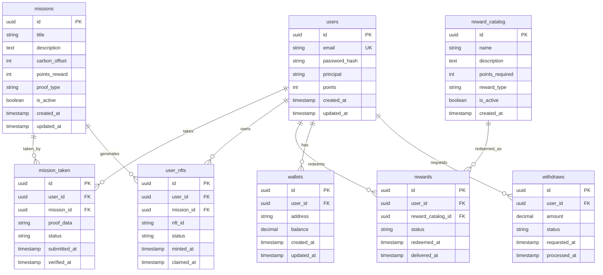

# PeduliCarbon System Design

## Overview

PeduliCarbon is a carbon offset platform that gamifies environmental actions through missions, NFTs, and rewards. The system integrates a Go backend with a Motoko canister on the Internet Computer (ICP) blockchain.

## Architecture Diagram

## User Flow Diagrams

### 1. User Registration Flow

### 2. Mission Completion Flow

### 3. NFT Claiming Flow

### 4. Reward Redemption Flow

## Database Schema

## Component Architecture

## Security Architecture

## Performance Architecture

## Deployment Architecture

## Technology Stack

### Backend
- **Language**: Go 1.21+
- **Framework**: Gin (HTTP router)
- **Database**: PostgreSQL 15+
- **Cache**: Redis 7+
- **Authentication**: JWT tokens
- **Blockchain**: Internet Computer (Motoko)

### Frontend (Integration)
- **Framework**: React/Vue.js/Angular
- **State Management**: Redux/Vuex/NgRx
- **HTTP Client**: Axios/Fetch
- **Wallet Integration**: Internet Identity

### Infrastructure
- **Containerization**: Docker
- **Orchestration**: Kubernetes/Docker Compose
- **CI/CD**: GitHub Actions
- **Monitoring**: Prometheus + Grafana
- **Logging**: ELK Stack

## Scalability Considerations

1. **Horizontal Scaling**: Multiple API instances behind load balancer
2. **Database Scaling**: Read replicas for read-heavy operations
3. **Caching Strategy**: Redis for session data and frequently accessed data
4. **CDN**: Static asset delivery
5. **Microservices**: Potential future migration for specific domains
6. **Event-Driven**: Async processing for non-critical operations

## Monitoring & Observability

This comprehensive system design provides visual representations of all major components and their interactions, making it easier for developers and stakeholders to understand the architecture and implementation details. 