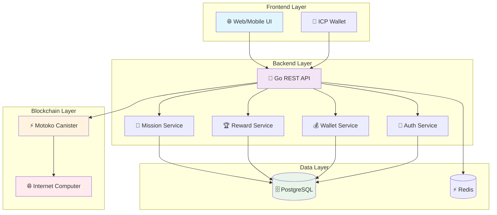
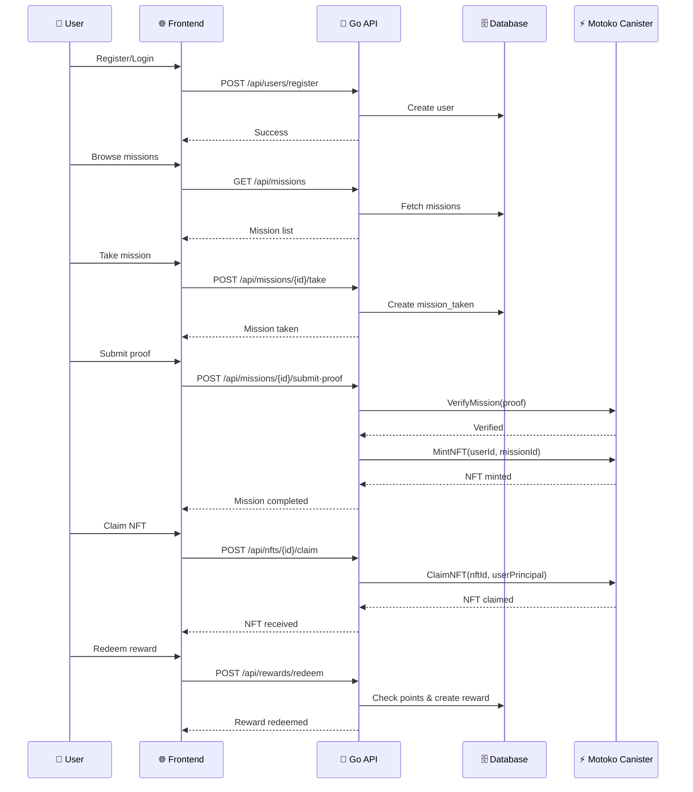
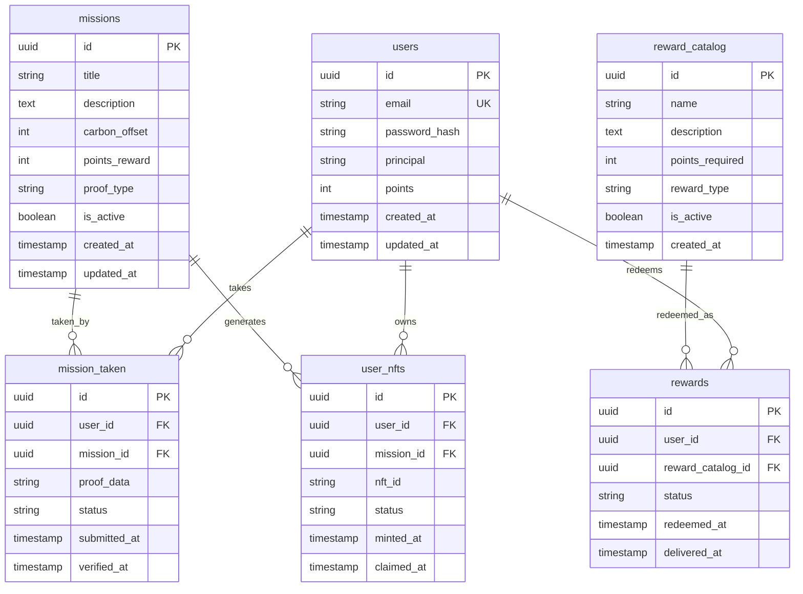
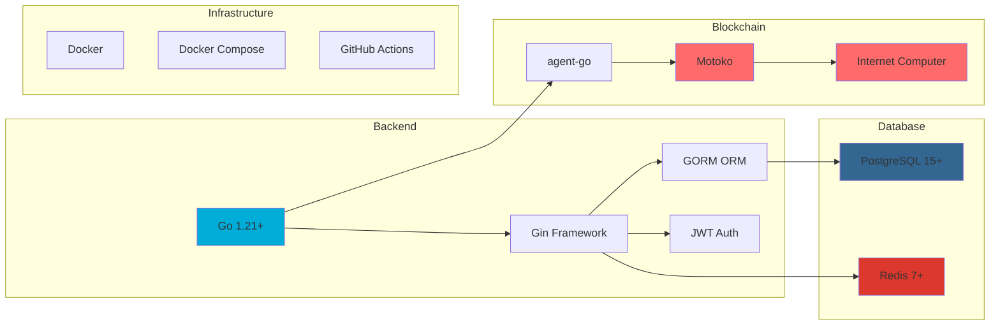

# PeduliCarbon 🌱

A gamified carbon offset platform that rewards environmental actions with NFTs and points on the Internet Computer blockchain.

## 🏗️ System Architecture



## 🎯 Core Features

- **🌱 Carbon Offset Missions**: Complete environmental challenges
- **🎨 NFT Rewards**: Earn unique NFTs for completed missions
- **🏆 Point System**: Accumulate points for rewards
- **💼 Digital Wallet**: Manage your carbon credits
- **🔐 Secure Authentication**: Email-based with ICP integration
- **📱 Mobile Ready**: Responsive design for all devices

## 🚀 Quick Start

### Prerequisites

- Go 1.21+
- PostgreSQL 15+
- Redis 7+
- dfx (Internet Computer SDK)
- Node.js 18+ (for testing)

### Installation

1. **Clone the repository**
   ```bash
   git clone https://github.com/yourusername/pedulicarbon.git
   cd pedulicarbon
   ```

2. **Set up environment variables**
   ```bash
   cp .env.example .env
   # Edit .env with your configuration
   ```

3. **Start dependencies**
   ```bash
   # Start PostgreSQL and Redis
   docker-compose up -d
   
   # Start local ICP replica
   dfx start --background
   ```

4. **Deploy Motoko canister**
   ```bash
   cd motoko/pedulicarbon
   dfx deploy
   ```

5. **Run the application**
   ```bash
   go run main.go
   ```

## 📊 User Flow



## 🗄️ Database Schema



## 🔧 API Endpoints

### Authentication
- `POST /api/users/register` - User registration
- `POST /api/users/login` - User login
- `GET /api/users/profile` - Get user profile

### Missions
- `GET /api/missions` - List all missions
- `POST /api/missions/{id}/take` - Take a mission
- `POST /api/missions/{id}/submit-proof` - Submit mission proof
- `GET /api/missions/taken` - Get user's taken missions

### NFTs
- `GET /api/nfts` - List user's NFTs
- `POST /api/nfts/{id}/claim` - Claim an NFT

### Rewards
- `GET /api/rewards/catalog` - List reward catalog
- `POST /api/rewards/redeem` - Redeem a reward
- `GET /api/rewards/history` - Get reward history

### Wallet
- `GET /api/wallet/balance` - Get wallet balance
- `POST /api/wallet/withdraw` - Request withdrawal

## 🛠️ Technology Stack



## 📁 Project Structure

```
pedulicarbon/
├── 📁 docs/                    # Documentation
│   ├── 📄 api_openapi.yaml     # API specification
│   ├── 📄 DEPLOYMENT.md        # Deployment guide
│   ├── 📄 FRONTEND_INTEGRATION.md
│   ├── 📄 TROUBLESHOOTING.md   # Troubleshooting guide
│   └── 📄 SYSTEM_DESIGN.md     # System design with diagrams
├── 📁 internal/                # Go application code
│   ├── 📁 api/                 # HTTP handlers
│   ├── 📁 model/               # Data models
│   ├── 📁 repository/          # Data access layer
│   ├── 📁 service/             # Business logic
│   └── 📁 motoko/              # Motoko client
├── 📁 motoko/                  # Motoko canister
│   └── 📁 pedulicarbon/
│       └── 📁 src/
│           └── 📄 main.mo
├── 📄 main.go                  # Application entry point
├── 📄 go.mod                   # Go dependencies
└── 📄 README.md                # This file
```

## 🚀 Deployment

### Local Development
```bash
# Start all services
docker-compose up -d
dfx start --background
dfx deploy

# Run application
go run main.go
```

### Production
```bash
# Build and deploy
docker build -t pedulicarbon .
docker-compose -f docker-compose.prod.yml up -d
```

## 🧪 Testing

### API Testing
```bash
# Run all tests
go test ./...

# Run specific test
go test ./internal/api -v

# Run with coverage
go test ./... -cover
```

### End-to-End Testing
```bash
# Test complete user flow
go run test-agent.go
```

## 📚 Documentation

- [📖 API Documentation](docs/api_openapi.yaml) - Complete API specification
- [🚀 Deployment Guide](docs/DEPLOYMENT.md) - Production deployment instructions
- [🔗 Frontend Integration](docs/FRONTEND_INTEGRATION.md) - Frontend integration guide
- [🛠️ Troubleshooting](docs/TROUBLESHOOTING.md) - Common issues and solutions
- [🏗️ System Design](docs/SYSTEM_DESIGN.md) - Detailed architecture and design

## 🤝 Contributing

1. Fork the repository
2. Create a feature branch (`git checkout -b feature/amazing-feature`)
3. Commit your changes (`git commit -m 'Add amazing feature'`)
4. Push to the branch (`git push origin feature/amazing-feature`)
5. Open a Pull Request

## 📞 Support

- **Issues**: [GitHub Issues](https://github.com/yourusername/pedulicarbon/issues)
- **Discussions**: [GitHub Discussions](https://github.com/yourusername/pedulicarbon/discussions)
- **Email**: support@pedulicarbon.com

## 🔮 Roadmap

- [ ] Mobile app development
- [ ] Advanced mission types
- [ ] Carbon credit marketplace
- [ ] Social features
- [ ] AI-powered mission suggestions
- [ ] Integration with external carbon offset providers

---

**Made with ❤️ for a greener future** 🌍 