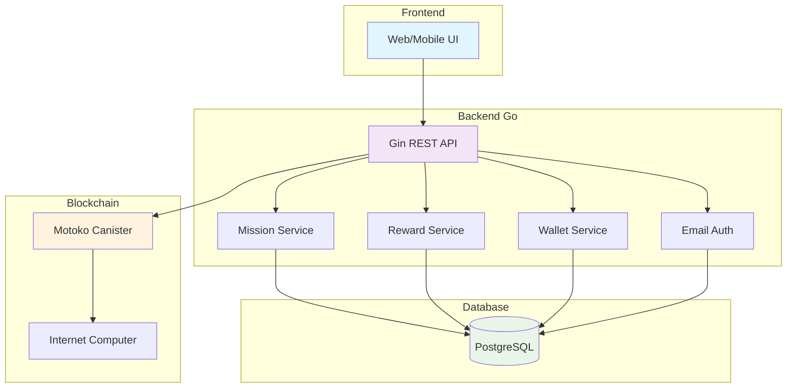
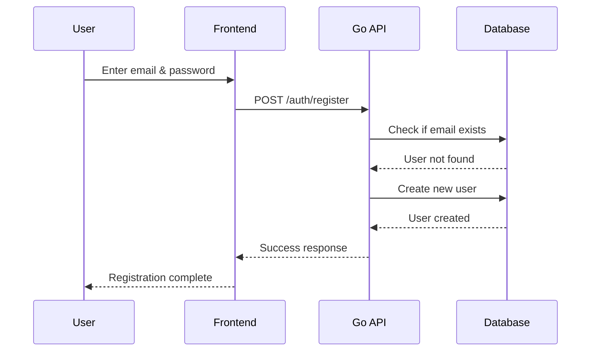
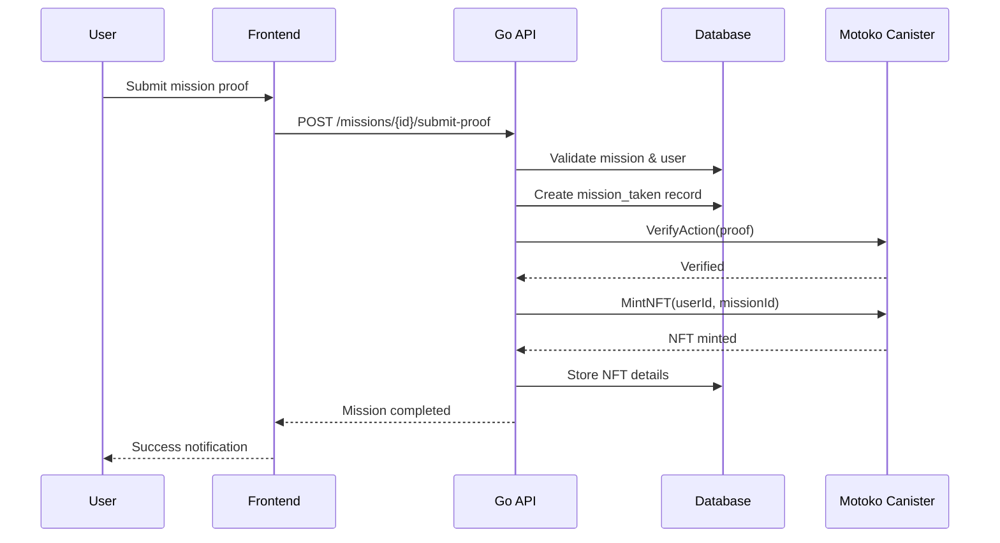
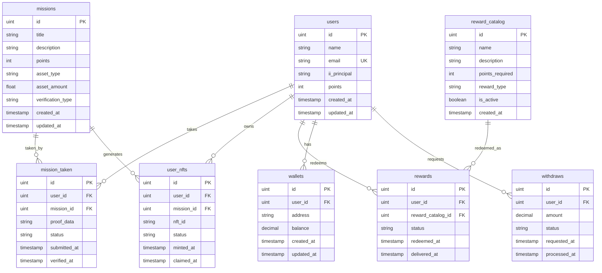
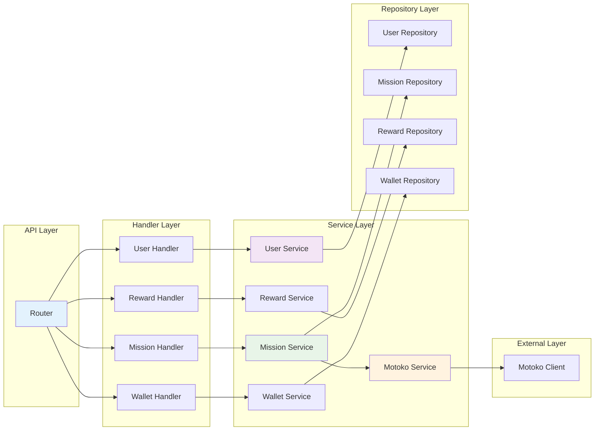
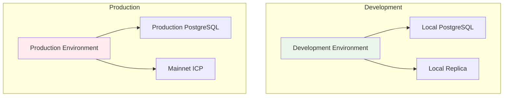

# PeduliCarbon System Design

## Overview

PeduliCarbon adalah platform carbon offset yang menggamifikasi aksi lingkungan melalui misi, NFT, dan rewards. Sistem mengintegrasikan backend Go dengan canister Motoko di Internet Computer (ICP) blockchain.

## Arsitektur Sistem

## User Flow

### 1. User Registration Flow

### 2. Mission Completion Flow

## Database Schema

## Component Architecture

## Technology Stack

### Backend
- **Language**: Go 1.21+
- **Framework**: Gin (HTTP router)
- **Database**: PostgreSQL 15+
- **ORM**: GORM
- **Authentication**: Email-based
- **Blockchain**: Internet Computer (Motoko)

### Frontend (Integration)
- **Framework**: React/Vue.js/Angular
- **HTTP Client**: Fetch/Axios
- **State Management**: Local state atau Redux/Vuex

### Infrastructure
- **Containerization**: Docker
- **Database**: PostgreSQL
- **Blockchain**: Internet Computer

## API Endpoints

### Authentication
- `POST /auth/register` - User registration
- `POST /auth/login` - User login
- `GET /users/profile/:id` - Get user profile

### Missions
- `GET /missions` - List all missions
- `GET /missions/:id` - Get specific mission
- `POST /missions` - Create new mission
- `POST /missions/:id/take` - Take a mission
- `POST /missions/:id/submit-proof` - Submit mission proof
- `POST /missions/:id/verify` - Verify mission
- `GET /users/:user_id/missions` - Get user's taken missions

### NFTs
- `GET /users/:user_id/nfts` - List user's NFTs
- `POST /nfts/:id/claim` - Claim an NFT

### Rewards
- `GET /rewards/catalog` - List reward catalog
- `POST /rewards/catalog/:id/redeem` - Redeem a reward
- `GET /rewards/user/:user_id` - Get user's rewards

### Wallet
- `GET /wallets/user/:user_id` - Get user wallet
- `POST /wallets` - Create wallet
- `PUT /wallets` - Update wallet
- `POST /wallets/withdraw` - Request withdrawal

## Security Considerations

1. **Authentication**: Email-based authentication dengan password hashing
2. **Authorization**: User-based access control
3. **Input Validation**: Validasi input di semua endpoint
4. **Database Security**: Prepared statements via GORM
5. **Blockchain Security**: Ed25519 identity untuk agent-go

## Performance Considerations

1. **Database Indexing**: Index pada email dan foreign keys
2. **Connection Pooling**: GORM connection pooling
3. **Caching**: Future implementation untuk frequently accessed data
4. **Load Balancing**: Multiple API instances untuk production

## Deployment Architecture

## Monitoring & Observability

1. **Logging**: Structured logging dengan Gin
2. **Error Tracking**: Error handling di semua layers
3. **Health Checks**: `/health` endpoint
4. **Metrics**: Future implementation dengan Prometheus

## Scalability Considerations

1. **Horizontal Scaling**: Multiple API instances
2. **Database Scaling**: Read replicas untuk read-heavy operations
3. **Caching Strategy**: Redis untuk session data
4. **Microservices**: Potential future migration

## Development Workflow

1. **Local Development**: Docker Compose untuk dependencies
2. **Testing**: Unit tests dan integration tests
3. **CI/CD**: GitHub Actions untuk automated testing
4. **Deployment**: Docker containers untuk production

## Future Enhancements

1. **Real-time Updates**: WebSocket integration
2. **Mobile App**: React Native atau Flutter
3. **Advanced Analytics**: User behavior tracking
4. **Social Features**: User interactions dan sharing
5. **AI Integration**: Smart mission recommendations 